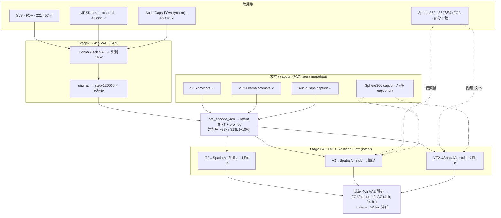

# Pipeline Status — (V | T) → Spatial Audio / Spatial Speech

> 最后更新：2026-06-02 · 单一事实来源（数据 / 模型 / 代码 / 三分支进度）
> 任务**不是** T2VA（不生成画面）。输出 = **FOA 4ch** 或 **binaural** 波形。

---

## 0. 总体框架图



生成路径：`条件(文本 ± 视频 ± format)` → **DiT 预测 64 维 latent** → **冻结 4ch VAE 解码** → **FLAC**（4ch FOA / binaural，24-bit；与 SLS/MRSDrama 落盘格式一致）。

> **输出格式约定**：所有解码/数据落盘统一 **FLAC**（无损、保相位）。`decode_latents_4ch.py` 已只产 `*_4ch.flac`（4ch）+ `reaper_listen/*_stereo_W.flac`（试听），无 WAV。AudioCaps-FOA 合成也是 FLAC PCM_24。

---

## 1. 三个分支进度

| 分支 | 任务 | VAE | 训练数据 | 条件 | pre-encode | DiT 配置 | DiT 训练 |
|------|------|-----|----------|------|-----------|----------|----------|
| **T2→SpatialA** | 文本→空间音频/语音 | [x] | SLS+MRSDrama+AudioCaps-FOA [x] | T5 prompt + spatial_format + seconds [x] | [~] 运行中 | [x] `stable_audio_4ch_text2spatial.json` | [ ] 未开始（**下一步**）|
| **V2→SpatialA** | 视频→空间音频 | [x] 共用 | Sphere360（FOA+视频）[~] 下载中 | CLIP 语义 + **VideoMAE-v2 运动(可选)** + format [x]代码 / [ ]接线 | [ ] | [~] `..._video2spatial_videomae.json` | [ ] |
| **VT2→SpatialA** | 视频+文本→空间音频 | [x] 共用 | Sphere360 [~] | CLIP + **VideoMAE-v2** + T5(+Sync/MAF) [x]代码 | [ ] | [~] `..._vt2spatial_videomae_qwen.json` | [ ] |

> **视频编码双流**（InternVideo 式）：`CLIP`=语义/文本对齐，`VideoMAE-v2`=运动/onset。两者作为**独立 conditioner 并存**，在 `cross_attention_cond_ids` 里同时列出即可（DiT 自动拼 token）。VideoMAE 特征**离线预抽**（不进训练循环）。

图例：`[x]` 完成 · `[~]` 进行中/部分 · `[ ]` 未开始

---

## 2. 数据集清单

| 数据集 | 路径 | 量 | 格式 | 文本 | 状态 |
|--------|------|----|------|------|------|
| Spatial LibriSpeech | `/mnt/sdb/.../spatial_librispeech/ambisonics` | 221,457 | FOA 4ch | `sls_prompts.jsonl` ✓ | [x] 就绪 |
| MRSDrama | `/mnt/sdd/.../mrsdrama/snapshot` | 46,680 | binaural | `mrsdrama_prompts.jsonl` ✓ | [x] 就绪 |
| AudioCaps-FOA (pyroom 合成) | `/mnt/sdc/audio_dataset_tmp/audiocaps_foa/train` | 45,178 | FOA 4ch | manifest caption ✓ | [x] 就绪 |
| AudioCaps (原始 mono) | `/mnt/sdd/.../audiocaps/snapshot/data` | 473 parquet | mono | 原生 caption | [x] 源（已合成 FOA）|
| Sphere360 | `/mnt/sdb/.../sphere360/media/{test,train}` | test 1,867 / train 6,339 webm | 360视频+FOA | ✗ 待 caption | [~] 下载中 |

**合计可编码音频 ≈ 313,315 条**（SLS+MRSDrama+AudioCaps-FOA）。

---

## 3. 模型 / 训练进度

| 阶段 | 产物 | 状态 |
|------|------|------|
| Stage-1 4ch VAE (Oobleck+GAN+EMA) | `epoch=34-step=145000.ckpt` 等全套 | [x] 训练完成 |
| VAE unwrap | `unwrapped_4ch_vae_step_120000.ckpt` | [x] 已验证（W_corr 0.78–0.94，可听）|
| Pre-encode → latent | `/mnt/sdc/audio_latents/stage1_vae_4ch` | [~] **运行中 ~33k/313k**，prompt 已烤入 |
| Stage-2 DiT (T2) | `dit_4ch_text2spatial` | [ ] 未开始 |
| Stage-3 DiT (V2/VT2) | — | [ ] 未开始 |

---

## 4. 代码清单

**数据/前处理**
- [x] `data/dataset_4ch.py` — 4ch 加载（无 phaseflip）+ **caption 注入**（path/stem 双匹配）
- [x] `dataset/indexing/build_spatial_prompts.py` — SLS(parquet) + MRSDrama(data.json) → prompts
- [x] `dataset/synthesis/synthesize_foa_pyroom.py` — pyroom FOA 引擎（静态/动态/混合 + 房间原型）
- [x] `dataset/synthesis/build_spatial_dataset.py` — 20 万条类别均衡 FOA 编排
- [x] `dataset/indexing/build_source_index.py` — 统一源池（audio/music/speech）
- [x] `dataset/captioning/refine_caption.py` — 空间 caption 精修（内容+方位+移动+房间）
- [x] `dataset/evaluation/eval_vae_recon.py` — VAE 重建评估（含 FOA 空间指标）
- [x] `dataset/captioning/caption_audio.py` — 纯音频 captioner（Qwen3-Omni-Captioner，给 Sphere360）
- [x] `dataset/captioning/caption_sphere360.py` — 视频/AV captioner
- [x] `pre_encode_4ch.py` / `unwrap_model.py` / `scripts/vae/eval/decode_latents_4ch.py` / `scripts/validate_4ch_vae_pack.py`
- [x] Sphere360 下载/校验/切分：`scripts/downloaders/{download,verify,split,trim}_sphere360*.py`

**模型/条件**
- [x] `configs/.../stable_audio_4ch_vae.json`（Stage-1）
- [x] `configs/.../stable_audio_4ch_text2spatial.json`（T2，**已验证可建 1.21B**）
- [~] `configs/.../stable_audio_4ch_video2spatial_videomae.json`、`..._vt2spatial_videomae_qwen.json`
- [x] `models/video_conditioners.py`（`clip` / `clip-with-sync-w-empty-feat` / `spatial_format` / **`videomae_v2` 运动流**；CLIP/Sync 的 mask 修为 `[B,N]` 以支持多路 cross-attn 共存）
- [x] `dataset/features/extract_videomae_features.py` — VideoMAE-v2 离线特征抽取（滑窗 `forward_features` → `[T_feat,C]` npy）。环境就绪：`timm`/`decord` 已入 `train`+`spatial` extra（现代 timm，直接调 builder 绕开 `create_model`）；ViT-B 权重已下 `/mnt/sdc/ckpts/videomae/distill/vit_b_k710_dl_from_giant.pth`（768维）
- [x] `models/multimodal_adaptive_fusion.py`（MAF）、`temporal_self_attention.py`、`synchformer/`
- [~] `models/dit_moe/cpe_moe.py` — CPE chunk-routing staging module，**默认关闭且尚未接入主线**

**数据集配置**
- [x] `local_4ch_vae.json`（VAE 训练）、`local_4ch_preencode.json`（编码，3 数据集+captions）
- [x] `local_4ch_t2a_preencoded.json`（**T2 DiT 训练**，读 `/mnt/sdc/audio_latents/stage1_vae_4ch`）
- [ ] `local_4ch_v2a_preencoded.json` / `..._vt2a_preencoded.json`（V2/VT2，待 Sphere360 pre-encode）

---

## 5. 已完成 / 未完成 / 待办

### 已完成 [x]
- [x] 4ch VAE 训练 + unwrap + 重建验证
- [x] 三个音频数据集就绪并**全部带文本 prompt**（SLS/MRSDrama/AudioCaps-FOA）
- [x] AudioCaps mono → FOA 合成（pyroom，45k）
- [x] caption 注入管线（pre-encode 时烤进 latent metadata）
- [x] T2 DiT 配置补全并验证可建模
- [x] 视频/文本条件模块迁入（CLIP/T5/MAF/Sync）

### 进行中 [~]
- [~] 全量 pre-encode（~10%，313k 目标）
- [~] Sphere360 媒体下载（test ~61% / train ~6%）

### 待办 [ ]（按优先级）
- [ ] **pre-encode 跑完** → 抽查 latent（prompt/shape/format）
- [ ] **（gate）AudioCaps-FOA 重建验证**：决定是否需把 audiocaps 加进 VAE 微调
- [ ] **启动 T2 DiT 训练**（`train.py` + `text2spatial` + `local_4ch_t2a_preencoded.json`）
- [ ] Sphere360：A/V 切分 → 提取 4ch FOA → caption → pre-encode（带 `video_path` 元数据）
- [ ] V2/VT2 数据集配置 + stub 补全为可训
- [ ] MoE 接入 `dit.py`（T2 稠密 baseline 跑通后）
- [ ] 3D/2D RoPE（latent 是 [64,T] 一维序列，需适配）

---

## 6. 缺口 / 待决策

1. **VAE 覆盖面**：VAE 只在 SLS+MRSDrama 上训，却要编码 AudioCaps-FOA。→ pre-encode 后**先验重建**，差才微调（加 audiocaps 进 `local_4ch_vae.json`，从 145k 续训，再重编码）。
2. **视频分支元数据（待接线）**：`videomae_v2` conditioner 已就绪（吃预抽特征），但 `pre_encode_4ch`/`dataset_4ch` 还没把 `video_path` / `videomae_feats`（`extract_videomae_features.py` 产出的 `.npy`）写进 latent 元数据 → V2/VT2 训练时取不到帧/运动特征。这是视频分支开训前的接线项。
   - 双流配置示例（在 `cross_attention_cond_ids` 同列）：`["prompt","clip","video_motion","spatial_format"]`，其中 `{"id":"video_motion","type":"videomae_v2","config":{"feat_dim":1408}}`。
3. **MRSDrama 文本是中文**：`textual_prompt`/`scene_prompt` 为英文已用；`raw_txt` 中文台词默认不入 prompt（T5-base 偏英文）。
4. **MoE / 3D RoPE 未接训练路径**：按计划放在稠密 T2 baseline 之后。
5. **Spatial Speech vs Audio**：暂靠数据 + prompt 区分，未加 `content_type` conditioner。
6. **latent_crop_length=512(≈24s)**：多数 clip ≤10–16s，padding 偏多，可降到 256 省算力（非必须）。

---

## 7. 下一步顺序

1. 继续 / 等待 pre-encode 完成（勿停）
2. 抽查 latent + AudioCaps 重建验证（决定 VAE 是否微调）
3. **Stage-2a：T2 DiT 训练**（dense DiT + rectified flow）
4. Sphere360 媒体补齐 → A/V 切分 + FOA 提取 + caption → 视频分支 pre-encode
5. Stage-3：V2 / VT2 训练（CLIP±Sync + MAF）
6. MoE 替换 FFN（baseline 之后）→ 3D RoPE 实验

---

## 8. 关键命令（详见 `scripts/docs/runbooks/RUN_UV.md`）

```bash
cd /home/tanhe/dataset_storage/stable-audio-tools

# 全量 pre-encode（运行中的命令）
uv run python pre_encode_4ch.py \
  --model-config stable_audio_tools/configs/model_configs/autoencoders/stable_audio_4ch_vae.json \
  --ckpt-path /mnt/sdc/ckpts/vae_4ch/unwrapped_4ch_vae_step_120000.ckpt \
  --dataset-config stable_audio_tools/configs/dataset_configs/local_4ch_preencode.json \
  --output-path /mnt/sdc/audio_latents/stage1_vae_4ch --no-pad --batch-size 1 --num-workers 16

# Stage-2a：T2 DiT（pre-encode 完成后，8 卡）
uv run python train.py \
  --model-config stable_audio_tools/configs/model_configs/txt2audio/t2a/dit/t5_1b.json \
  --dataset-config stable_audio_tools/configs/dataset_configs/local_4ch_t2a_preencoded.json \
  --pretransform-ckpt-path /mnt/sdc/ckpts/vae_4ch/unwrapped_4ch_vae_step_120000.ckpt \
  --name dit_4ch_text2spatial_m0 \
  --batch-size 8 --precision bf16-mixed \
  --save-dir /mnt/sdc/ckpts/dit_4ch_text2spatial --checkpoint-every 5000
# 注：train.py 用 prefigure，无 --num-gpus；Trainer devices="auto" 自动用满所有可见 GPU（CUDA_VISIBLE_DEVICES 控制用哪几张）
```
