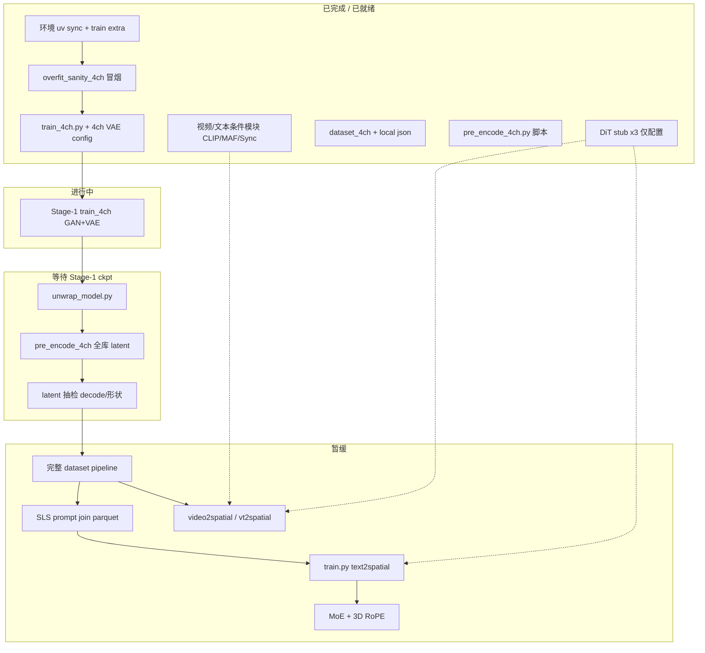

# 4ch Spatial Audio — 总 Workflow

**当前主线**：只验证 **4ch VAE + pre-encode**。DiT（text / video / vt2spatial）等 dataset pipeline 就绪后再开。

**三种生成接口（未来 DiT，均为输出空间音频，非 T2VA）**：

| 模式 | 配置 stub |
|------|-----------|
| text2spatial | `stable_audio_4ch_text2spatial_stub.json` |
| video2spatial (v2spatial) | `stable_audio_4ch_video2spatial_videomae.json` |
| vt2spatial | `stable_audio_4ch_vt2spatial_videomae_qwen.json` |

---

## Pipeline 总览（折线 / 流程图）



---

## 分阶段清单

### Phase 0 — 环境与冒烟 ✅

| 步骤 | 状态 | 说明 |
|------|------|------|
| `uv sync --extra train` | ✅ | |
| `overfit_sanity_4ch` | ✅ | 输出在 `/mnt/sdc/vae_4ch_sanity_out/step_*/` |
| `decord` / video conditioner import | ✅ | 可选 |

### Phase 1 — Stage-1：4ch VAE 训练 🔄

| 步骤 | 状态 | 命令 |
|------|------|------|
| 正式训练 | 🔄 进行中 | 见下方「Stage-1 命令」 |
| 听感 / loss 判断 | ⏳ | checkpoint 每 5000 step |

**完成标准**：重建可接受；可进入 unwrap。

### Phase 2 — 4ch 处理：unwrap + pre-encode ⏳

| 步骤 | 状态 | 说明 |
|------|------|------|
| unwrap Lightning ckpt | ⏳ | 得到纯 `AudioAutoencoder` 权重 |
| pre_encode 全库 | ⏳ | `[64, T]` `.npy` + `.json` |
| 检查 `spatial_format` 等 | ⏳ | 新 encode 含该字段 |

**完成标准**：`/mnt/sdc/audio_latents/stage1_vae_4ch` 可给未来 DiT 用。

### Phase 3 — DiT 生成（text / v / vt）⬜ 未开始

依赖：Phase 2 latent + dataset pipeline（视频路径、prompt 等）。

---

## 命令备忘（Phase 1 → 2）

### Stage-1（现在跑）

```bash
cd /home/tanhe/dataset_storage/stable-audio-tools

uv run python train_4ch.py \
  --model-config stable_audio_tools/configs/model_configs/autoencoders/stable_audio_4ch_vae.json \
  --dataset-config stable_audio_tools/configs/dataset_configs/local_4ch_example.json \
  --pretrained-ckpt-2ch /mnt/sdc/ckpts/stable-audio-open-1.0/model.safetensors \
  --name vae_4ch_stage1 \
  --batch-size 8 \
  --num-gpus 1 \
  --precision bf16-mixed \
  --save-dir /mnt/sdc/ckpts/vae_4ch \
  --checkpoint-every 5000
```

Checkpoint 示例路径：`/mnt/sdc/ckpts/vae_4ch/epoch=0-step=5000.ckpt`（以实际文件名为准）。

### Unwrap（Stage-1 结束后）

```bash
cd /home/tanhe/dataset_storage/stable-audio-tools

uv run python unwrap_model.py \
  --model-config stable_audio_tools/configs/model_configs/autoencoders/stable_audio_4ch_vae.json \
  --ckpt-path /mnt/sdc/ckpts/vae_4ch/epoch=0-step=XXXXX.ckpt \
  --name unwrapped_4ch_vae

# 默认写在当前目录；建议挪到固定位置：
mv unwrapped_4ch_vae.ckpt /mnt/sdc/ckpts/vae_4ch/
```

### Pre-encode（unwrap 之后）

```bash
# 全库（不加 --limit-batches）
uv run python pre_encode_4ch.py \
  --model-config stable_audio_tools/configs/model_configs/autoencoders/stable_audio_4ch_vae.json \
  --ckpt-path /mnt/sdc/ckpts/vae_4ch/unwrapped_4ch_vae_step_50000.ckpt \
  --dataset-config stable_audio_tools/configs/dataset_configs/local_4ch_preencode.json \
  --output-path /mnt/sdc/audio_latents/stage1_vae_4ch \
  --no-pad --batch-size 1 --num-workers 8

# Trial（检查 latent 格式；进度条应显示 50/50 而非 268137）
CUDA_VISIBLE_DEVICES=0 uv run python pre_encode_4ch.py \
  ...同上... \
  --output-path /mnt/sdc/audio_latents/stage1_vae_4ch_trial \
  --limit-batches 50
```

---

## Sanity 输出：`in` vs `rec`

路径：`/mnt/sdc/vae_4ch_sanity_out/step_000250/` 等。

| 文件后缀 | 含义 |
|----------|------|
| `*_in.wav` | **输入**：裁切+归一化后的 **4 通道真值**（送进 `encode` 之前） |
| `*_rec.wav` | **重建**：`decode(encode(输入))`，即 **VAE 重建结果** |

**有没有做重建？** 有。`rec` 就是重建；对比 `in` 与 `rec` 可听 codec 质量。

**同一 step 里多对文件名（如 `000000` 与 `segment_0`）？**

- 不是「同一条音频两种处理」。
- 是 **同一小 batch 里不同样本**：例如 SLS 的 `000000.flac` → `000000_in/rec`，MRSDrama 的片段 → `segment_0_in/rec`。
- 每对 `{name}_in` + `{name}_rec` 才是一对输入/重建。

注意：sanity **没有 GAN**，与正式 `train_4ch` 听感可能略有差别；最终以 Stage-1 正式 ckpt 为准。

---

## 配置 stub 对照

| 文件 | 条件 | 阶段 |
|------|------|------|
| `stable_audio_4ch_text2spatial_stub.json` | T5 + format | DiT |
| `stable_audio_4ch_video2spatial_videomae.json` | VideoMAE-v2 + format | DiT |
| `stable_audio_4ch_vt2spatial_videomae_qwen.json` | VideoMAE-v2 + Qwen text + format | DiT |

详见 [`PIPELINE_STATUS.md`](PIPELINE_STATUS.md)、
[`../runbooks/RUN_UV.md`](../runbooks/RUN_UV.md)。
